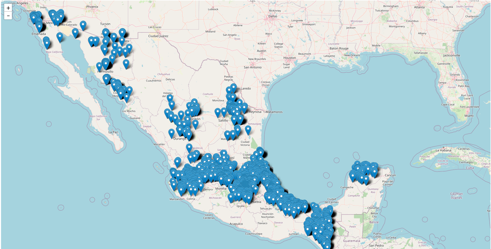

# geocoding

Obtención de coordenadas geográficas a partir de bases de datos con campos de texto que refieren a direcciones en México.

La metodogía incluye tres etapas principales de procesamiento que deben ejecutarse en orden:

1. Geocodificación no verificada
2. Verificación de coordenadas mediante Spatial Join
3. Filtrado


El script `softGeocoding.py` reconstruye direcciones para usarlas como query en la  API de  Geocoding de ArcGis denominada findAddressCandidates.

El resultado de la consulta puede recuperar varias coordenadas para la misma query. Por ejemplo:


```
[
  {'address': 'Calle Santa Genoveva 1227, La Purísima, Guadalupe, Nuevo León, 67129', 'location': {'x': -100.234310021733, 'y': 25.706879997489}, 'extent': {'xmin': -100.235310021733, 'ymin': 25.705879997489, 'xmax': -100.233310021733, 'ymax': 25.707879997489}},

  {'address': '67129, La Purísima, Guadalupe, Nuevo León', 'location': {'x': -100.232863740334, 'y': 25.706111762909}, 'extent': {'xmin': -100.237863740334, 'ymin': 25.701111762909, 'xmax': -100.227863740334, 'ymax': 25.711111762909}}
]

```


El script `joincandidates.py` utiliza datos geográficos oficiales de México* para proyectar los puntos de los candidatos (generados en la etapa previa) sobre los polígonos de colonias de México mediante la operación de spatial join con lo cual se puede validar la coincidencia entre direcciones y puntos con los polígonos oficiales a nivel colonia, CP, municipio y entidad. Análogamente, los puntos sin congruencia con la información oficial pueden ser identificados.


* INE, CentroGeo (2014). Colonias de México, INE, 2010 -  Representación vectorial de los asentamientos de las colonias. Recuperado de la Plataforma GeoWeb IDEGeo del Centro de Investigación en Ciencias de Información Geoespacial el 28 de Agosto de 2023 de https://idegeo.centrogeo.org.mx/layers/geonode:ine2010_colonias_areas


Finalmente el script `finalfilter.py` aplica el criterio de filtrado para obtener las coordenadas más precisas basándose en la proyección de los puntos con información oficial pero también comparando la similitud entre las direcciones originales y las recuperadas. Esto se realiza mediante un algoritmo basado en la distancia de Levenshtein.

Por ejemplo, en la siguiente ilustración, las dos direcciones tienen 78% de similitud.


El resultado final son datos georreferenciados con buena precisión.




## Dependencias

* Python 3.8.0
* requests==2.27.1
* geopandas==0.8.1
* thefuzz==0.19.0


## Notas

Para bases de datos muy grandes se recomienda seccionar la tabla a procesar de manera que se puede realizar el procesamiento en paralelo y se pueden hacer invocaciones asíncronas a la API.

En linux se recomienda el comando `split`:

```
$ split [options] filename prefix
```


## Built With

* [idegeo](https://idegeo.centrogeo.org.mx/layers/geonode:ine2010_colonias_areas) - INE, CentroGeo (2014). Colonias de México, INE, 2010 -  Representación vectorial de los asentamientos de las colonias. Recuperado de la Plataforma GeoWeb IDEGeo del Centro de Investigación en Ciencias de Información Geoespacial.
* [Geopandas](https://geopandas.org/en/stable/gallery/spatial_joins.html) - Creating spatial join between points and polygons in GeoPandas.
* [thefuzz](https://github.com/seatgeek/thefuzz) - Fuzzy string matching based on Levenshtein Distance to calculate the differences between sequences.


## Autor

**Alejandro Molina-Villegas**
Investigador CONAHCYT - Centro de Investigación en Ciencias de Información Geoespacial

amolina@centrogeo.edu.mx

Tel. 01 (999) 688 53 00 Ext. 1005

* [CONAHCyT-CentroGeo](https://www.centrogeo.org.mx/areas-profile/amolina#investigacion)


